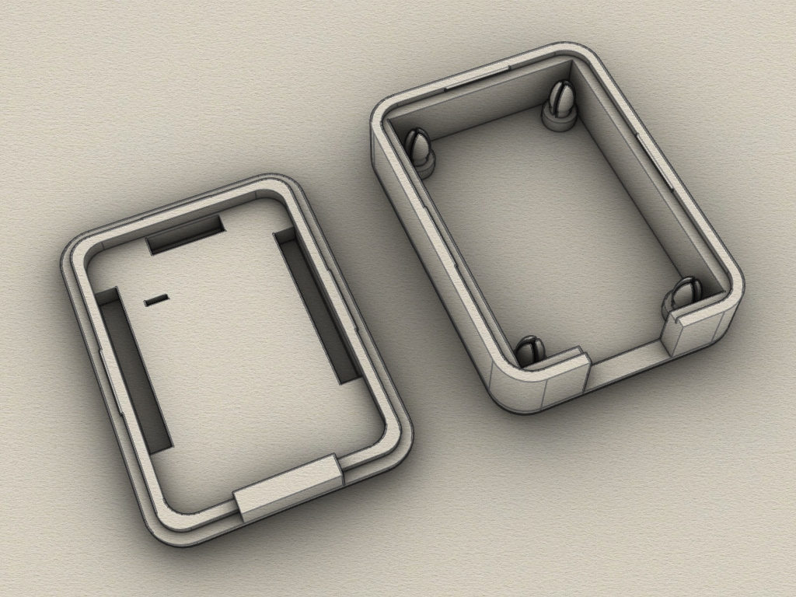
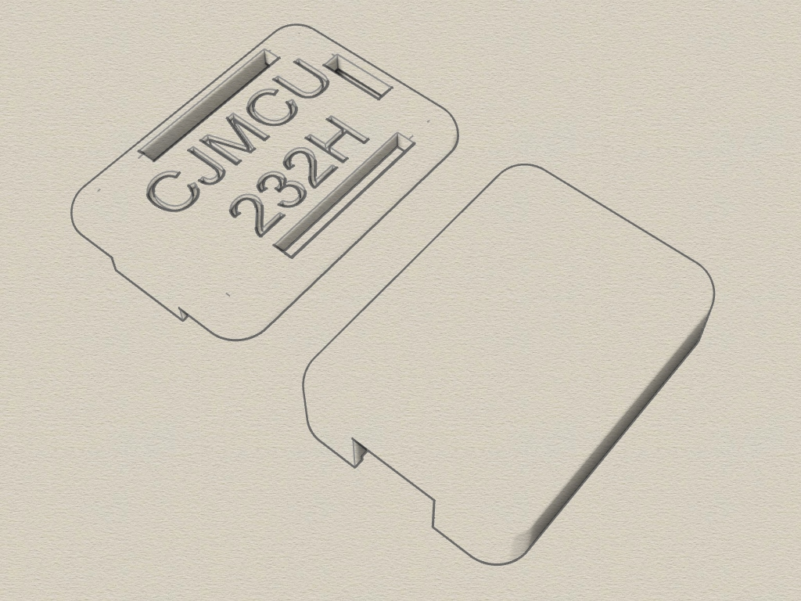
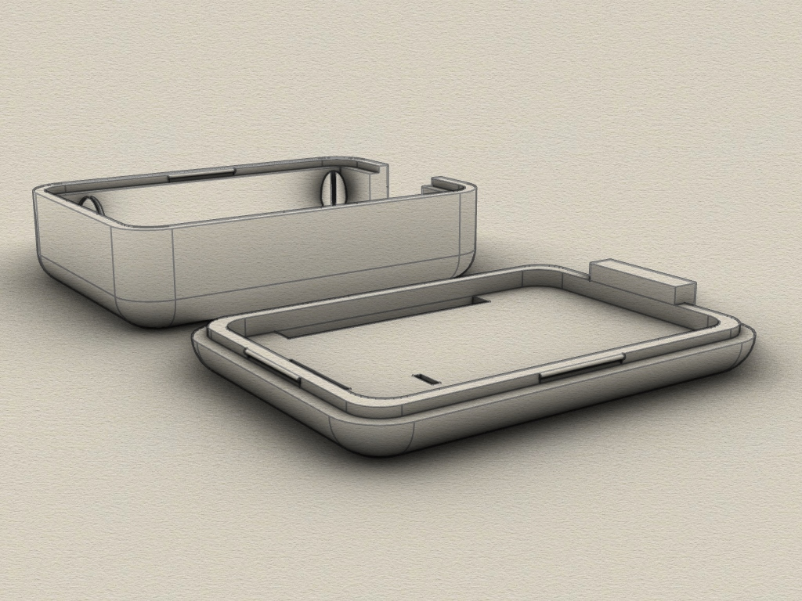
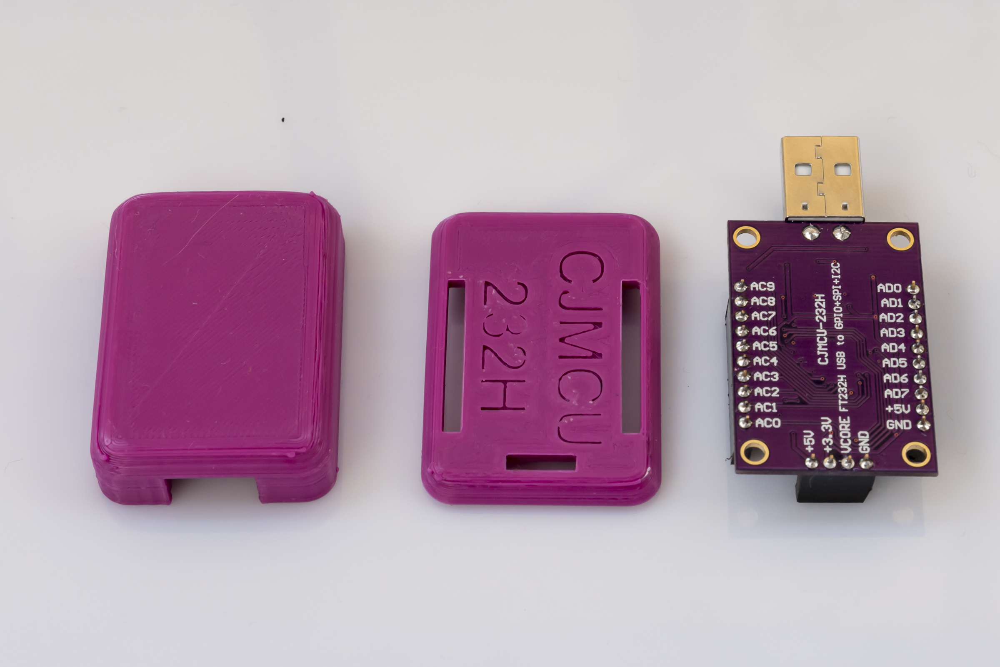
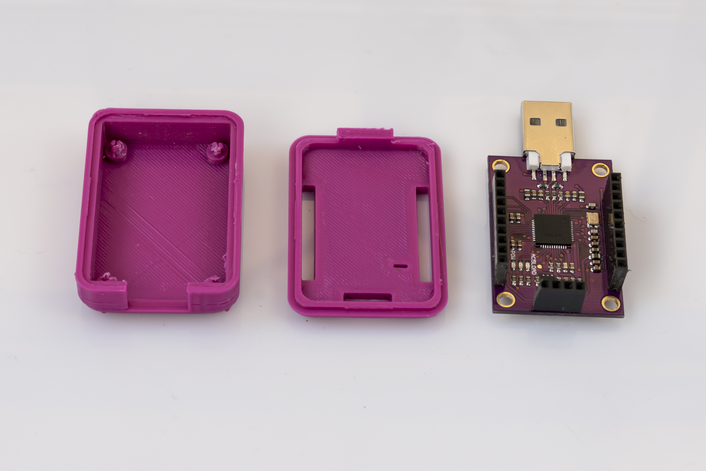
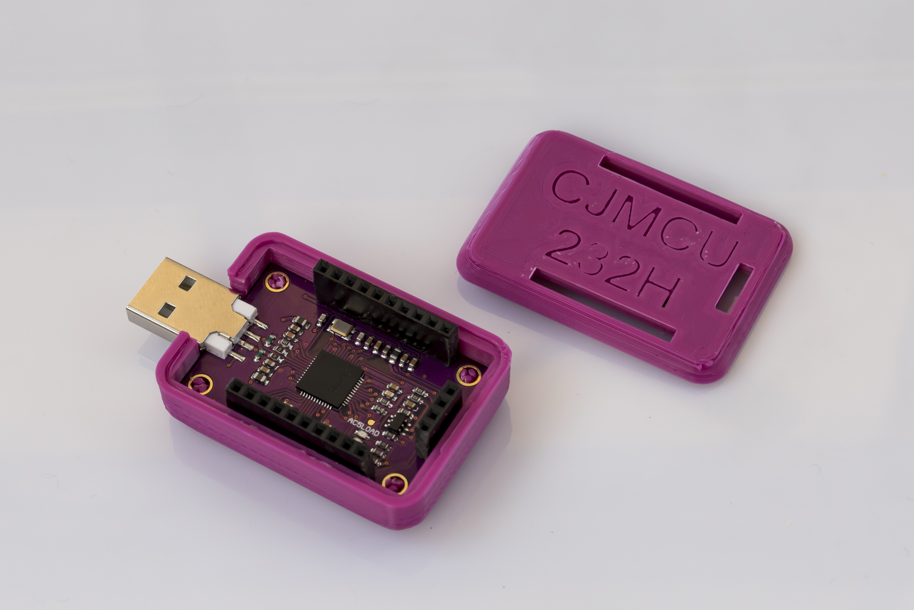
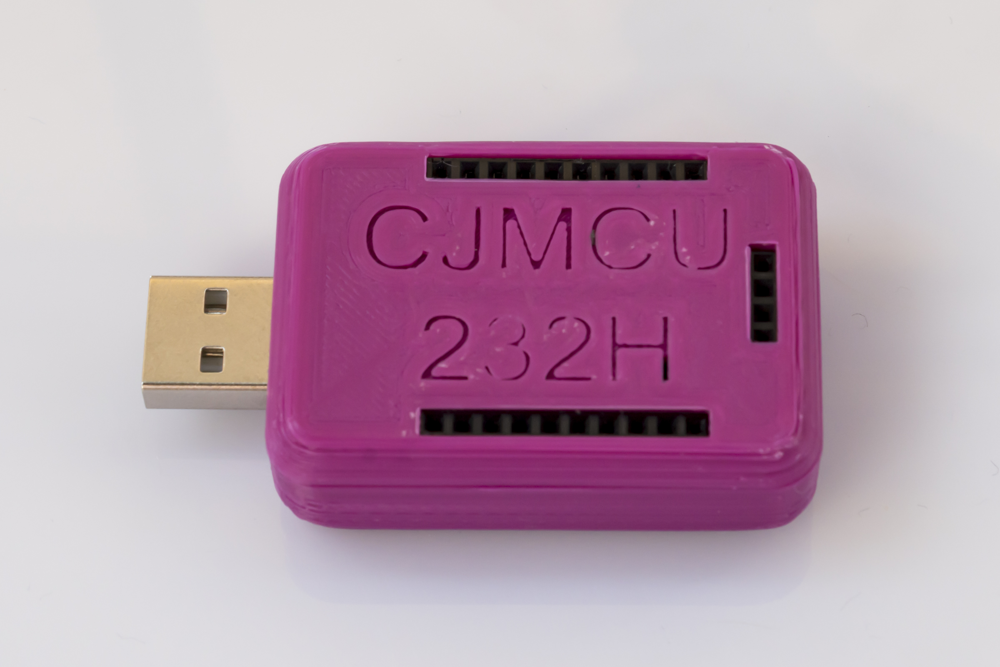

# 3D enclose for CJMCU-232H (The Shikra clone)
3D printable case for CJMCU-232H Adapter (STL File, Created with Rhino 6)

## 3D Case

The enclosure consists of 2 parts which held together by itself. 

Requirements:
* 3D printer 
* Filament of your choice
* no screws

## View

